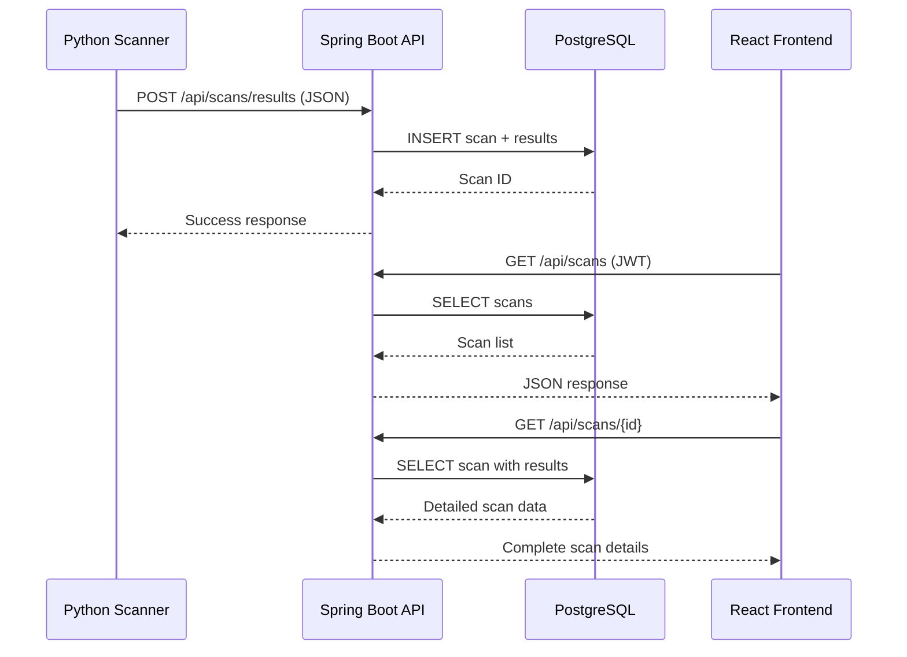

# 🛡️ ZeroThreat - Plateforme de Cybersécurité


**ZeroThreat** est une plateforme SaaS professionnelle de scan automatisé des vulnérabilités. Elle combine la puissance de Nmap, SQLMap et Nikto dans une interface web moderne pour détecter et analyser les failles de sécurité de votre infrastructure.

## 📋 Table des matières

- [Fonctionnalités](#-fonctionnalités)
- [Architecture](#-architecture)
- [Technologies](#-technologies)
- [Installation](#-installation)
- [Utilisation](#-utilisation)
- [Structure du projet](#-structure-du-projet)
- [API Documentation](#-api-documentation)
- [Sécurité](#-sécurité)
- [Contribuer](#-contribuer)

## ✨ Fonctionnalités

### 🔍 Scanner Python
- **Scan Nmap** : Détection des ports ouverts, services et versions
- **Scan SQLMap** : Détection automatique des injections SQL
- **Scan Nikto** : Analyse des vulnérabilités web
- **Agrégation JSON** : Résultats normalisés et structurés
- **Intégration API** : Envoi automatique au backend

### 🚀 Backend Spring Boot
- **API RESTful** : Endpoints sécurisés et documentés
- **Authentification JWT** : Sécurité robuste
- **Base PostgreSQL** : Stockage relationnel optimisé
- **Migrations Flyway** : Gestion de schéma automatisée
- **Architecture en couches** : Controller → Service → Repository

### 💻 Frontend React
- **Design moderne** : Interface dark mode cybersécurité
- **Dashboard interactif** : Visualisation des scans
- **Graphiques Chart.js** : Statistiques visuelles
- **Responsive** : Compatible mobile et desktop
- **Temps réel** : Mise à jour automatique des résultats

## 🏗️ Architecture

```
┌─────────────────────────────────────────────────────────────┐
│                      ZEROTHREAT PLATFORM                     │
└─────────────────────────────────────────────────────────────┘

┌──────────────────┐         ┌──────────────────┐
│  Python Scanner  │────────▶│   Spring Boot    │
│  (Nmap/SQLMap/   │  POST   │   REST API       │
│   Nikto)         │  JSON   │   (Port 8080)    │
└──────────────────┘         └────────┬─────────┘
                                      │
                                      │ JDBC
                                      ▼
                             ┌──────────────────┐
                             │   PostgreSQL     │
                             │   Database       │
                             │   (Port 5432)    │
                             └──────────────────┘
                                      ▲
                                      │ REST API
                                      │
                             ┌────────┴─────────┐
                             │  React Frontend  │
                             │  (Port 3000)     │
                             └──────────────────┘
```

### Flux de données



## 🛠️ Technologies

### Backend
- **Java 17+**
- **Spring Boot 3.2.0**
- **Spring Security** (JWT)
- **Spring Data JPA**
- **PostgreSQL 15+**
- **Flyway** (migrations)
- **Maven**

### Frontend
- **React 18**
- **React Router DOM**
- **Axios**
- **Chart.js**
- **Vite**

### Scanner
- **Python 3.10+**
- **Nmap**
- **SQLMap**
- **Nikto**
- **Requests**

## 📦 Installation

### Prérequis

1. **Java 17+**
```bash
java -version
```

2. **Node.js 18+**
```bash
node -v
npm -v
```

3. **Python 3.10+**
```bash
python3 --version
```

4. **PostgreSQL 15+**
```bash
psql --version
```

5. **Outils de sécurité**
```bash
# macOS
brew install nmap sqlmap nikto

# Ubuntu/Debian
sudo apt-get install nmap sqlmap nikto

# Arch Linux
sudo pacman -S nmap sqlmap nikto
```

### 1️⃣ Configuration de la base de données

```bash
# Se connecter à PostgreSQL
psql -U postgres

# Créer la base de données et l'utilisateur
CREATE DATABASE zerothreat_db;
CREATE USER zerothreat WITH PASSWORD 'zerothreat_password';
GRANT ALL PRIVILEGES ON DATABASE zerothreat_db TO zerothreat;
\q
```

### 2️⃣ Installation du Backend

```bash
cd backend

# Configurer application.properties si nécessaire
# Modifier les credentials PostgreSQL

# Compiler et lancer
mvn clean install
mvn spring-boot:run
```

Le backend sera accessible sur `http://localhost:8080`

### 3️⃣ Installation du Frontend

```bash
cd frontend

# Installer les dépendances
npm install

# Lancer le serveur de développement
npm run dev
```

Le frontend sera accessible sur `http://localhost:3000`

### 4️⃣ Configuration du Scanner

```bash
cd scanner

# Installer les dépendances Python
pip install -r requirements.txt

# Configurer les variables d'environnement
cp .env.example .env
# Éditer .env avec vos paramètres
```

## 🚀 Utilisation

### 1. Créer un compte

1. Accédez à `http://localhost:3000`
2. Cliquez sur "S'inscrire"
3. Remplissez le formulaire
4. Vous serez automatiquement connecté

### 2. Lancer un scan

```bash
cd scanner

# Scan basique
python scanner.py 192.168.1.10

# Scan avec URL personnalisée
python scanner.py 192.168.1.10 --url http://example.com

# Sauvegarder localement
python scanner.py 192.168.1.10 --save-local

# Mode hors ligne (pas d'envoi API)
python scanner.py 192.168.1.10 --no-api
```

### 3. Visualiser les résultats

1. Connectez-vous au dashboard
2. Consultez la liste des scans
3. Cliquez sur "Détails" pour voir :
   - Ports ouverts (Nmap)
   - Injections SQL (SQLMap)
   - Vulnérabilités web (Nikto)
   - Graphiques interactifs

## 📁 Structure du projet

```
ZeroThreat/
├── scanner/                    # Module Python
│   ├── scanner.py             # Scanner principal
│   ├── config.py              # Configuration
│   ├── requirements.txt       # Dépendances Python
│   └── README.md              # Documentation scanner
│
├── backend/                    # Module Spring Boot
│   ├── src/
│   │   ├── main/
│   │   │   ├── java/com/zerothreat/
│   │   │   │   ├── entity/           # Entités JPA
│   │   │   │   ├── repository/       # Repositories
│   │   │   │   ├── service/          # Services métier
│   │   │   │   ├── controller/       # Contrôleurs REST
│   │   │   │   ├── dto/              # Data Transfer Objects
│   │   │   │   ├── security/         # JWT & Security
│   │   │   │   └── config/           # Configuration
│   │   │   └── resources/
│   │   │       ├── application.properties
│   │   │       └── db/migration/     # Scripts Flyway
│   │   └── test/                     # Tests unitaires
│   └── pom.xml                       # Maven configuration
│
├── frontend/                   # Module React
│   ├── src/
│   │   ├── pages/             # Pages React
│   │   │   ├── LandingPage.jsx
│   │   │   ├── Login.jsx
│   │   │   ├── Register.jsx
│   │   │   ├── Dashboard.jsx
│   │   │   └── ScanDetails.jsx
│   │   ├── services/          # API services
│   │   │   └── api.js
│   │   ├── styles/            # CSS
│   │   │   └── global.css
│   │   ├── App.jsx            # App principal
│   │   └── main.jsx           # Point d'entrée
│   ├── package.json
│   └── vite.config.js
│
└── README.md                   # Ce fichier
```

## 📡 API Documentation

### Authentification

#### POST /api/auth/register
Créer un nouveau compte utilisateur.

**Request:**
```json
{
  "username": "john_doe",
  "email": "john@example.com",
  "password": "securepass123"
}
```

**Response:**
```json
{
  "token": "eyJhbGciOiJIUzI1NiIsInR5cCI6IkpXVCJ9...",
  "type": "Bearer",
  "id": 1,
  "username": "john_doe",
  "email": "john@example.com"
}
```

#### POST /api/auth/login
Se connecter avec un compte existant.

**Request:**
```json
{
  "username": "john_doe",
  "password": "securepass123"
}
```

### Scans

#### POST /api/scans/results
Soumettre les résultats d'un scan (utilisé par le scanner Python).

**Headers:**
```
Authorization: Bearer <token>
```

**Request:**
```json
{
  "target": "192.168.1.10",
  "timestamp": "2025-12-03T14:30:00",
  "nmap": [
    {
      "port": 80,
      "protocol": "tcp",
      "service": "http",
      "version": "Apache 2.4.41",
      "state": "open"
    }
  ],
  "sqlmap": [
    {
      "vulnerability_type": "Boolean-based blind",
      "parameter": "id",
      "payload": "AND 1=1",
      "description": "SQL injection detected"
    }
  ],
  "nikto": [
    {
      "osvdb_id": "3233",
      "method": "GET",
      "uri": "/admin/",
      "description": "Admin directory found"
    }
  ]
}
```

#### GET /api/scans
Récupérer la liste des scans (paginée).

**Query Parameters:**
- `page` (default: 0)
- `size` (default: 10)

#### GET /api/scans/{id}
Récupérer les détails complets d'un scan.

## 🔒 Sécurité

### Authentification JWT

Tous les endpoints (sauf `/api/auth/*`) nécessitent un token JWT valide :

```javascript
headers: {
  'Authorization': 'Bearer <your-jwt-token>'
}
```

### Bonnes pratiques

1. **Changez le secret JWT** dans `application.properties` en production
2. **Utilisez HTTPS** en production
3. **Limitez les scans** aux systèmes autorisés
4. **Stockez les credentials** de manière sécurisée
5. **Mettez à jour** régulièrement les dépendances

### ⚠️ Avertissement légal

**IMPORTANT** : N'utilisez ZeroThreat que sur des systèmes pour lesquels vous avez une autorisation explicite. L'utilisation non autorisée d'outils de scan de sécurité peut être illégale dans votre juridiction.

## 🎨 Design System

### Couleurs

```css
--bg-primary: #0a0e27;        /* Fond principal */
--bg-secondary: #1a1f3a;      /* Fond secondaire */
--accent-primary: #00d9ff;    /* Cyan électrique */
--accent-secondary: #0066ff;  /* Bleu électrique */
--success: #00ff88;           /* Vert succès */
--warning: #ffaa00;           /* Orange warning */
--danger: #ff3366;            /* Rouge danger */
```

### Typographie

- **Headings** : Rajdhani (Google Fonts)
- **Body** : Inter (Google Fonts)

## 🧪 Tests

### Backend
```bash
cd backend
mvn test
```

### Frontend
```bash
cd frontend
npm test
```

## 🚀 Déploiement

### Production Build

**Backend:**
```bash
cd backend
mvn clean package
java -jar target/zerothreat-backend-1.0.0.jar
```

**Frontend:**
```bash
cd frontend
npm run build
# Servir le dossier dist/ avec nginx ou autre
```

### Docker (optionnel)

Vous pouvez créer des Dockerfiles pour chaque module et utiliser docker-compose pour orchestrer l'ensemble.

## 📝 Licence

Ce projet est sous licence MIT. Voir le fichier `LICENSE` pour plus de détails.

## 👥 Auteurs

- **Abderahmane Nazim HAMIA** - Plateforme de cybersécurité professionnelle

## 🙏 Remerciements

- **Nmap** - Network scanner
- **SQLMap** - SQL injection tool
- **Nikto** - Web vulnerability scanner
- **Spring Boot** - Java framework
- **React** - UI library

---

<div align="center">

**🛡️ ZeroThreat - Analysez, détectez, sécurisez. 🛡️**

Made with ❤️ for cybersecurity professionals

</div>
